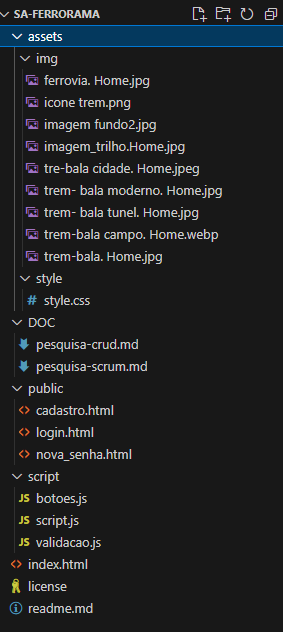

# SA_Ferrorama
Proposta do Sistema:
Criar um aplicativo que receba, processe e exiba em tempo real os dados enviados pelos sensores IoT instalados na locomotiva e nos trilhos, permitindo o acompanhamento do desempenho do trem, a identificação de falhas e a geração de relatórios analíticos.

## Objetivos do projeto:
Desenvolver sistema de monitoramento ferroviário em tempo real, com sensores iot, processamento e análise de dados.

## Membros da equipe:
Hugo Ricardo Gramme, Eduardo henrique Lopes, Luis Gustavo, Guilherme Henrique

## Funcionalidades
Recebimento de dados em tempo real. Dashboard de monitoramento. Detecção de falhas. Análise de dados. Relatórios analíticos. Gestão de dados.

# 📁 Organização do Projeto
 
## Estrutura de Pastas
 

 
